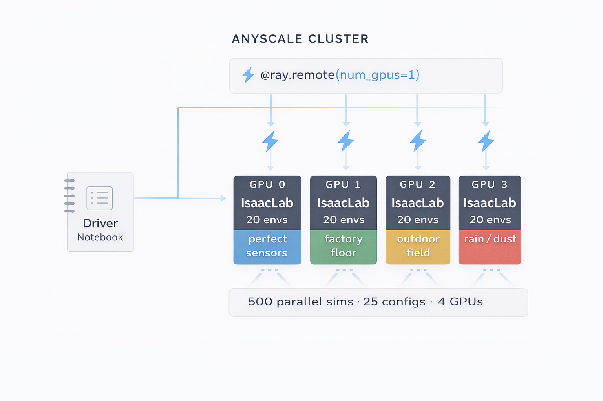
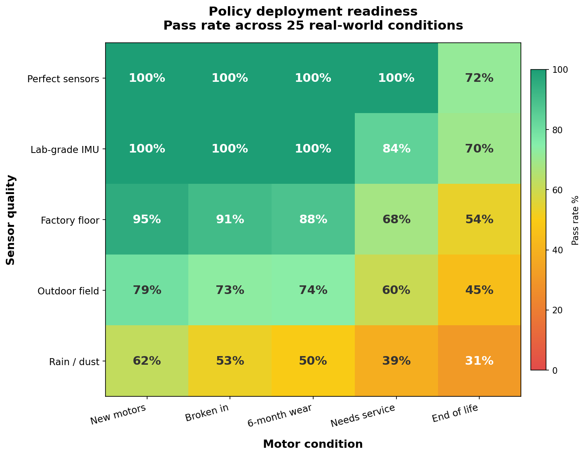
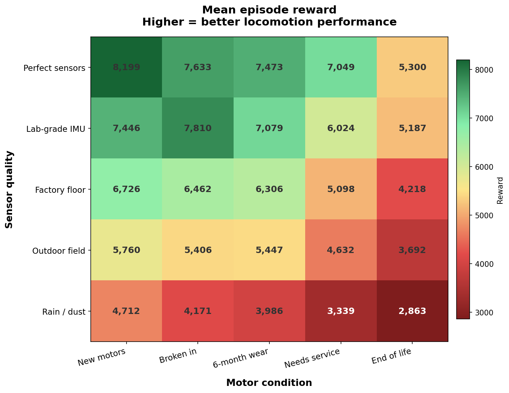

# Distributed Robot Simulation with Ray Core and Isaac Lab

Train, evaluate, and stress-test robot policies at scale on Anyscale using plain Ray Core. No RLlib, no custom frameworks, just `@ray.remote`.

---

## Architecture

<p align="center">
  
</p>

**Three steps:**
1. **Wrap** the simulator — `env.py` isolates Isaac Lab in a subprocess via `multiprocessing.Pipe`
2. **`@ray.remote(num_gpus=1)`** — any function becomes a distributed GPU task
3. **Fan out** — Ray schedules 25 configs across 4 GPUs, aggregates results

```python
@ray.remote(num_gpus=1)
def evaluate_config(config, checkpoint):
    env = IsaacLabDirectEnv(task="Isaac-Humanoid-Direct-v0", num_envs=20, device="cuda:0")
    # Run 1500 steps with noise injected ...
    return {"pass_rate": ..., "mean_reward": ...}

# One line to fan out across the cluster
futures = [evaluate_config.remote(cfg, checkpoint) for cfg in configs]
results = ray.get(futures)
```

---

## What this demo shows

| Capability | What happens | Time |
|-----------|-------------|------|
| **Distributed PPO training** | GPU workers collect rollouts in parallel, driver updates policy | ~2 hrs |
| **Robustness sweep** | 25 perturbation configs evaluated across 4 GPUs | ~20 min |
| **Deployment insight** | Heatmaps show exactly where the policy is safe vs fails | instant |

---

## Why this matters

Robots trained in simulation often fail in the real world.

**Simulation assumes:** perfect sensors, perfect motors, stable environments.

**Reality has:** sensor noise, actuator wear, unpredictable conditions.

This demo closes that gap. You fan out many slightly different environments in parallel and measure exactly where the policy breaks — in minutes, not hours.

---

## The robustness sweep

Before deploying, test the policy under real-world conditions:

| Sensor quality | Simulates | Motor condition | Simulates |
|---------------|-----------|----------------|-----------|
| **Perfect sensors** | Lab-calibrated, zero drift | **New motors** | Fresh actuators |
| **Lab-grade IMU** | High-quality industrial | **Broken in** | Light use |
| **Factory floor** | Standard, some vibration | **6-month wear** | Normal wear |
| **Outdoor field** | Dust, temperature swings | **Needs service** | Overdue maintenance |
| **Rain / dust** | Degraded, wet, dirty | **End of life** | Worn bearings, backlash |

5 x 5 = **25 configs**, each running 20 parallel humanoids for 1500 steps on a GPU.

**Result:** Policy passes 100% in clean conditions, drops to 31% in rain with end-of-life motors. Safe to deploy up to factory floor with serviced motors.

---

## Results preview

<p align="center">
  
</p>

<p align="center">
  
</p>

<p align="center">
  
</p>

---

## Project structure

| File | Description |
|------|-------------|
| `isaac_lab_ray_core_DEMO.ipynb` | **Start here** — end-to-end notebook with plots and dashboard |
| `run_sweep.py` | Standalone robustness sweep script (runs from terminal) |
| `env.py` | Isaac Lab wrapper — subprocess isolation, `.reset()` / `.step()` |
| `train_general.py` | Distributed PPO training, any Isaac Lab task |
| `sweep_eval.py` | Sweep evaluation utilities |
| `eval_pretrained.py` | Quick evaluation of pre-trained checkpoint |
| `Containerfile` | Anyscale image: Ray + Isaac Sim 5.1 + Isaac Lab |
| `media/` | Plots, GIFs, architecture diagram |

---

## Quick start

### 1. Set up Anyscale workspace

- **Image:** Custom image built from `Containerfile` (base: `anyscale/ray:2.53.0-slim-py311-cu128`)
- **Head:** `m5.2xlarge` (CPU)
- **Workers:** 4x `g5.xlarge` (A10G GPU)

### 2. Run the notebook

Open `isaac_lab_ray_core_DEMO.ipynb` and **Run All**.

The notebook loads pre-computed sweep results from JSON — **plots render instantly, no GPU wait.** To run a live sweep, uncomment the sweep cell.

### 3. Run the sweep from terminal

```bash
python run_sweep.py
```

Launches 25 configs across 4 GPUs, saves results to `/mnt/cluster_storage/sweep_results_full.json`. Takes ~20 min.

### 4. Train from scratch (optional)

```bash
python train_general.py \
  --task Isaac-Humanoid-Direct-v0 \
  --num-workers 4 \
  --num-envs-per-worker 512 \
  --lr 3e-4 \
  --num-iters 5000
```

---

## Environment wrapper

`env.py` runs Isaac Lab in a subprocess via `multiprocessing.Pipe`. Isaac Sim needs its own event loop — this keeps it isolated from Ray.

```python
from env import IsaacLabDirectEnv

env = IsaacLabDirectEnv(task="Isaac-Humanoid-Direct-v0", num_envs=1024, device="cuda:0")
obs = env.reset()                              # (1024, 75) numpy array
obs, rewards, dones, infos = env.step(actions)  # numpy in, numpy out
env.close()
```

Works with any Isaac Lab task — Humanoid, Ant, Cartpole, Franka, ANYmal.

---

## Pre-trained checkpoint

Humanoid policy (reward ~8000) available at:
```
s3://air-example-data/isaac_lab_template_checkpoint/
```

Converted to PyTorch at `/mnt/cluster_storage/checkpoints/humanoid/checkpoint_pretrained.pt`.

---

## Documentation

- [Isaac Lab](https://isaac-sim.github.io/IsaacLab/)
- [Ray Core](https://docs.ray.io/en/latest/ray-core/walkthrough.html)
- [Anyscale workspaces](https://docs.anyscale.com/platform/workspaces)

---

## Notes

- GPU workers boot Isaac Lab on first use (~2 min for PhysX to load). This is expected.
- Results save to `/mnt/cluster_storage/sweep_results_full.json` — notebook reloads from there if kernel restarts.
- The `omni.physx.plugin` warnings in worker logs are normal and can be ignored.
